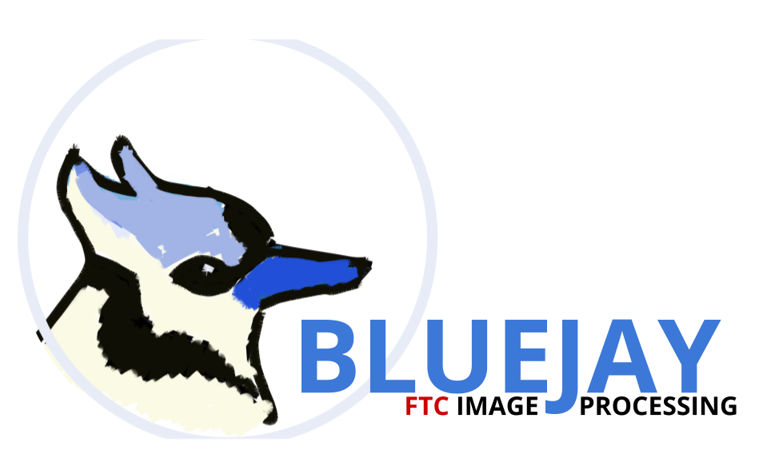
# FTC Team #14473 Future - Image processing Framework [Currently in Intense Development]

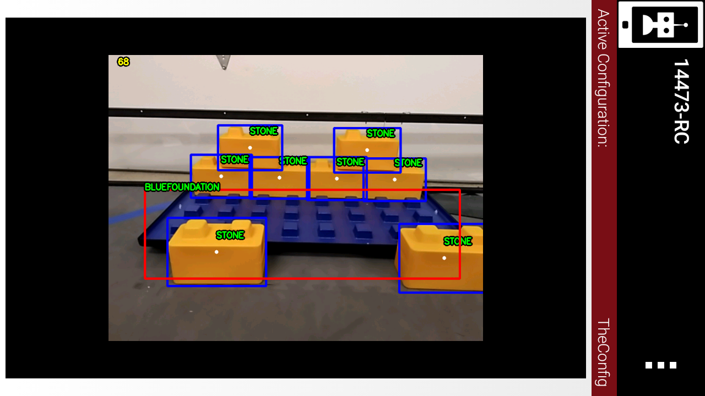
	
This library was made to simplify the agony in doing FTC computer vision in Java.   
It follows very simple rules:

- It can be used for all seasons. This code will always be useful unless FTC changes their software setup.

- If you don't need it, you should never see it. All the boilerpalce nitty gritty is handled by magick.

## Features

- **OpenCV Foundation Detection**
- **Opencv Stone Detection** (Pretty good 90%)
- **Opencv SkyStone Detection** (Bestest one)
- simplified interface for Vuforia and tensorflow
- All the above running simultaneously

## Maximizing Accuracy
- Angle the phone so that the field covers as much of the camera image as possible (best performance with elements on field)
- Don't let stones overlap vertically. The stone detector is optimized for horozontal rows of stones.
- Don't let elements get too far away. Small shapes will be calssified as noise
- Don't tilt the camera (like when you steer the car in asphalt 8). The shape classifier will get confused.

## Setup
1. Clone and make a new project at new>project>from version control>git in Android Studio. Code is in the `Teamcode` folder and `bluejay` module. We might do bintray hosting but haven't had time yet :p
2. Sync Gradle. Search for this command with ctrl+shift+a.
3. Examples are in the `teamcode` folder.

## Using the Library
I've been lax on documentation, so ask if there is ambiguity
First off, working code for everyone:

	*Stuff here is outdated, bleh. Check teamcode for example.	

All classes that the user uses follow a simple guideline: a constructor with clear parameter requirements, a `start()` method to begin computing, a `stop()` method to stop computing, and one method with `get` at the beginning of its name. This returns whatever the class is used for.

For example:

	ImageDetector detector = new ImageDetector(this, false);
	detector.start();

Is used to get the Vuforia localizer running. It requires an opmode instance and a boolean for whether the RC should display its view.

Please realize the purpose of the `start()` and `stop()` methods. We've made a careful decision to include them even though they make the library more complicated. Keeping all the detectors active (ie. calling start() for each) will cause your framerate to plummet and latency to increase.

To request data, simply do:

	detector.getPosition();

For the OpenCV Element detector, there are some special rules since I haven't standardized it yet:
- To toggle detection for each element, set the `Pipeline.doSkyStones`, `Pipeline.doStones`, and `Pipeline.doFoundations` static booleans to True or False.
- To turn on/off the ENTIRE detector, use`start()` and `stop()`. Note that turning off all individual element detections will still consume resources as there are common shared algorithms that run regardless of whether element detection is on or off.

A note: the IMU class, as a non-absolute Localizer, will always return the difference in position since __the last time you called its getter method__. That means that if the robot spins more than 360 degrees between that time, you will have an unreliable rotational reading.
	

## Contact
If you got questions, email me at <xchenbox@gmail.com> or alternatively, find us on Facebook <https://www.facebook.com/future14473>
We don't have a discord (yet). If there's any problems or ambiguity, shoot me an email

## Gallery

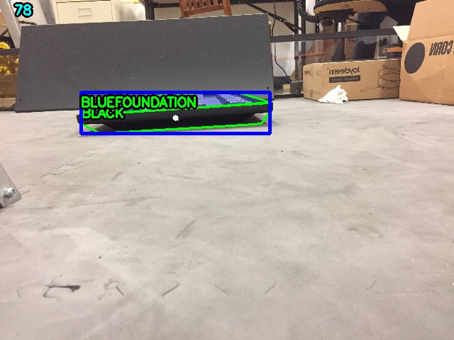
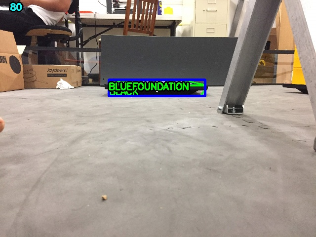
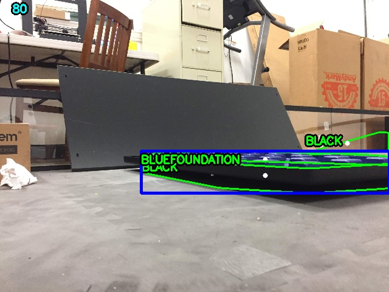
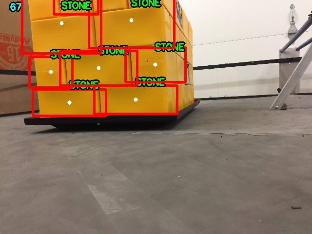
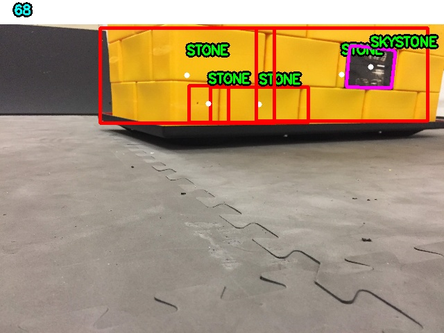
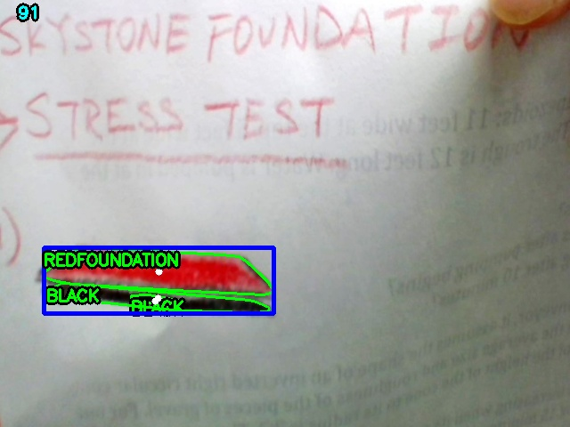
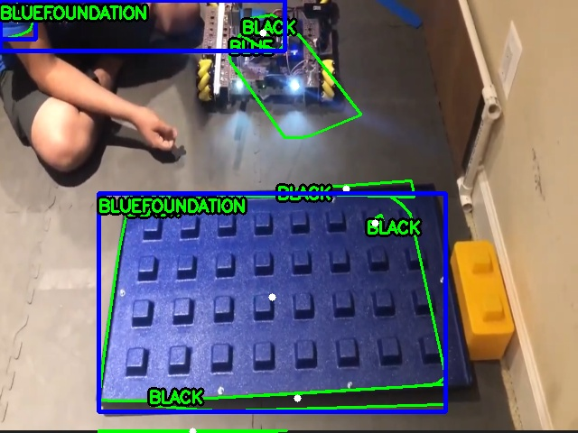
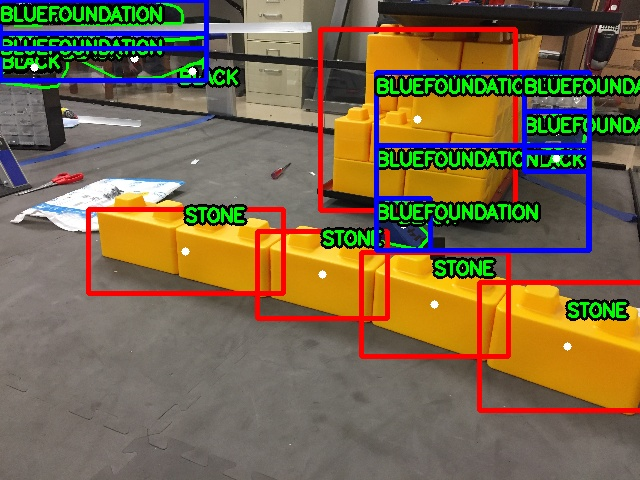
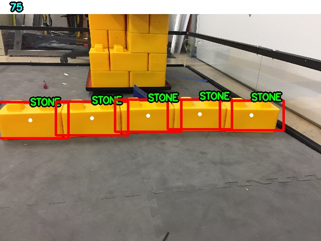
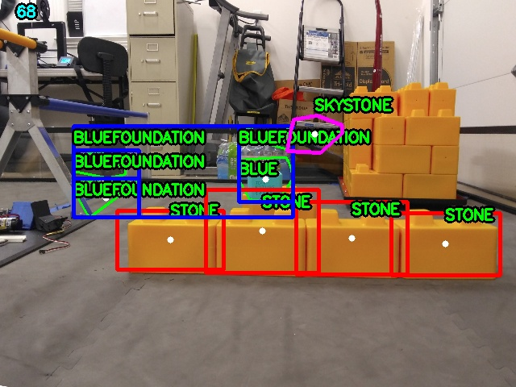
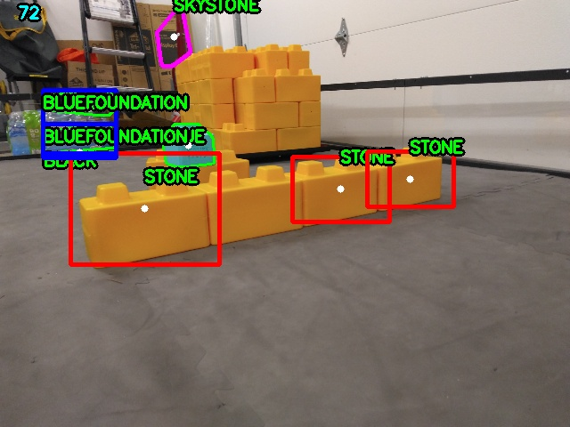
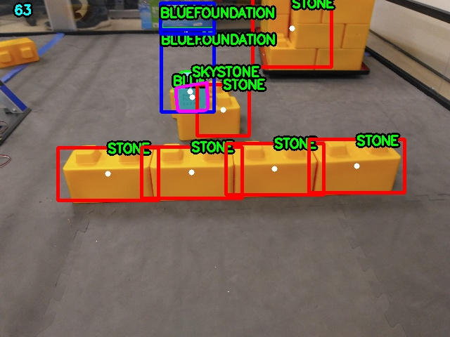
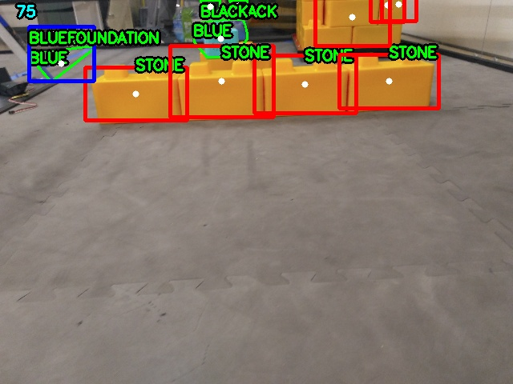
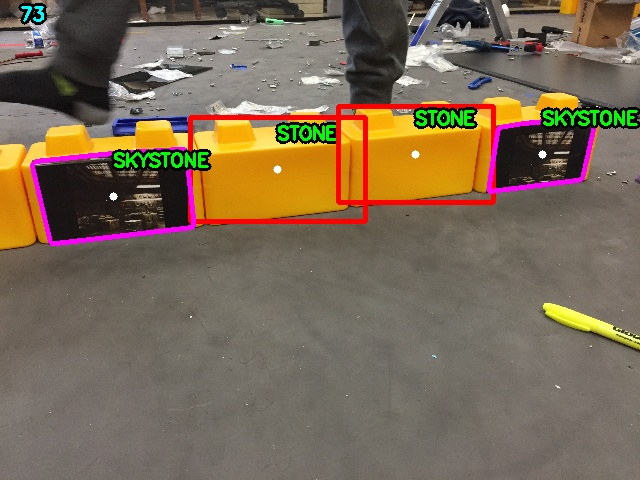
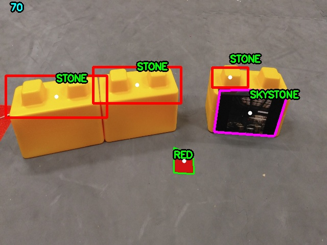
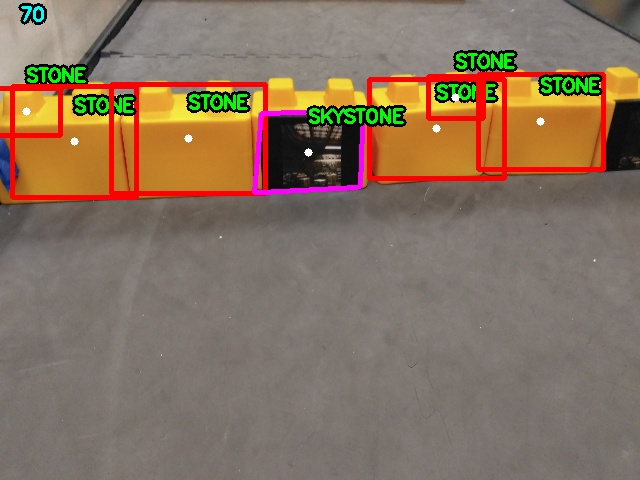
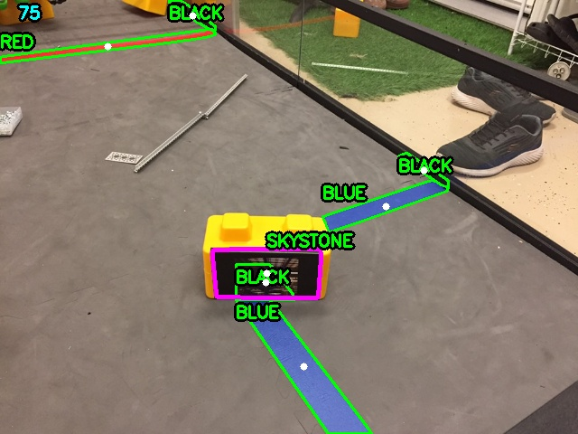
