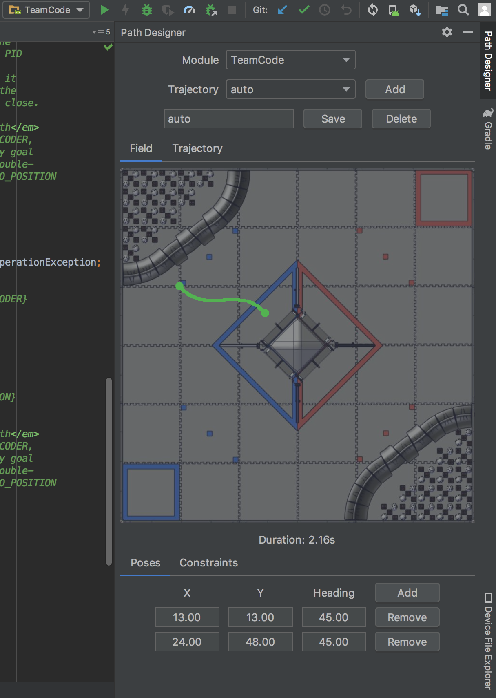
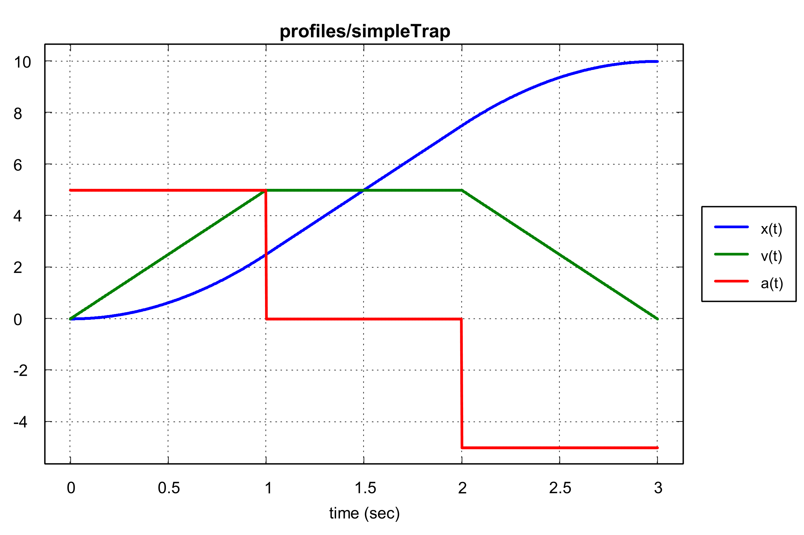

# Road Runner [](https://bintray.com/acmerobotics/maven/road-runner/_latestVersion)

A simple Kotlin library for planning 2D mobile robot paths and trajectories designed for FTC. **Note:** this project is in alpha and many of the APIs are incubating.

<p align="center"></span>

## Installation

### Core

1. Load your `ftc_app` project into Android Studio.

1. Open up the `build.gradle` file in the module you'd like to install in (usually `TeamCode`).

1. At the bottom of the file, add a `repositories` block with `jcenter()`. Next add a `dependencies` block with `compile 'com.acmerobotics.roadrunner:core:0.2.0'`. After you're finished, your `build.gradle` should look like this:

    ```groovy
    // beginning of the file

    repositories {
        // other repositories
        jcenter()
    }

    dependencies {
        // other dependencies
        compile 'com.acmerobotics.roadrunner:core:0.2.0'
    }
    ```

1. Sync the project (Android Studio should prompt you to do this).

1. You're finished!

1. In some cases, Road Runner's dependencies may exceed the limit of method references. To fix it, add `compile 'com.android.support:multidex:1.0.3'` to your dependencies (for more information, see [this article](https://developer.android.com/studio/build/multidex)) and add `multiDexEnabled true` to the `defaultConfig` closure (for FTC, this is located inside `build.common.gradle`).

### GUI

Road Runner includes a simple GUI for generating trajectories from pose waypoints and constraints. You can download the latest version from the Releases tab (or build it with `./gradlew shadowJar`).

### Plugin

Road Runner also includes a simple Android Studio plugin based upon the GUI. Here are some instructions for building and loading the plugin:

1. Download the latest plugin zip from Releases or build it with `./gradlew buildPlugin`.

1. In Android Studio, navigate to Settings > Plugins.

1. Click the button that reads `Install plugin from disk...`.

1. Select the zip archive from earlier.

1. Restart Android Studio to activate plugin changes.

1. Click on "Path Designer" on the right side of the editor and the tool window should appear.

## Documentation

The documentation for all releases are available online in the [KDoc format](https://acmerobotics.github.io/road-runner/core/0.2.0/kdoc/) (more accurately reflects the Kotlin source) and in the more traditional [Javadoc format](https://acmerobotics.github.io/road-runner/core/0.2.0/javadoc/).

## Getting Started

For a complete example of using Road Runner in FTC, see the [quickstart](https://github.com/acmerobotics/road-runner-quickstart).

### Motion Profiles

Motion profiles are core to this library and effective control of robot actuators. The combination of feedforward and feedback control (for example, PID controllers) can greatly improve accuracy and reduce mechanical strain on your robot. For more information about motion profiles (and motion control in general), see [the canonical talk](https://www.youtube.com/watch?v=8319J1BEHwM) by mentors from FRC teams 254 and 971.

Conceptually, motion profiles are time-based descriptions of your robot's kinematic state (in this case, its position, velocity, and acceleration) that obey your mechanism's constraints (maximum velocity and maximum acceleration for Road Runner). For example, here'a  pre-planned motion profile with a maximum acceleration of 5 in/s^2 and a maximum velocity of 5 in/s over 10in:



As you can see, this profile is considered trapezoidal due to the shape of the velocity curve over time. All it takes to generate a profile like this in Road Runner is a single method call:

```java
MotionProfile profile = MotionProfileGenerator.generateSimpleMotionProfile(
    new MotionState(0, 0, 0), // start state
    new MotionState(10, 0, 0), // goal state
    5, // max vel
    5 // max accel
);
```

or

```kotlin
val profile = MotionProfileGenerator.generateSimpleMotionProfile(
    MotionState(0.0, 0.0, 0.0),
    MotionState(10.0, 0.0, 0.0),
    5.0, 5.0
)
```

The `profile` object can then be used to find the motion state at any point in time.

### Paths

While one-dimensional profiles are useful for mechanisms with one degree of freedom (for example, elevators, arms, and turrets), they aren't super useful by themselves for drive movement. To take full advantage of your drivetrain's capabilities, you must also define a 2D path for it to follow.

For now, lines and quintic splines are the two built-in path constructs. However, any sufficiently continuous parametric curve can work. Here's the syntax for creating a line:

```java
Path line = new Path(new LineSegment(
    new Vector2d(10, 10), // start position
    new Vector2d(20, 20) // end position
));
```

or

```kotlin
val line = Path(LineSegment(Vector2d(10.0, 10.0), Vector2d(20.0, 20.0)))
```

Similarly, here's a sample spline declaration:

```java
Path spline = new Path(new QuinticSplineSegment(
    new QuinticSplineSegment.Waypoint(10, 10, 10, 0), // start position and derivatives
    new QuinticSplineSegment.Waypoint(20, 20, 0, 10) // end position and derivatives
));
```

 or

```kotlin
val spline = Path(QuinticSplineSegment(
    QuinticSplineSegment.Waypoint(10.0, 10.0, 10.0, 0.0),
    QuinticSplineSegment.Waypoint(20.0, 20.0, 0.0, 10.0)
))
```

Paths also describe the robot's heading in addition to its XY position. For tank/differential drive robots (and other with nonholonomic constraints), the heading always points in the direction of the curve. However, for holonomic robots (for example, mecanum, X-drive, H-drive, or ball drive), the heading is fully controllable. To change the default heading behavior, simply pass a heading interpolator as the second argument to the `Path` constructor:

```java
Path constantHeadingSpline = new Path(new QuinticSplineSegment(
    new QuinticSplineSegment.Waypoint(10, 10, 10, 0), // start position and derivatives
    new QuinticSplineSegment.Waypoint(20, 20, 0, 10) // end position and derivatives
), new ConstantInterpolator(Math.toRadians(45)));
```

or

```kotlin
val spline = Path(QuinticSplineSegment(
    QuinticSplineSegment.Waypoint(10.0, 10.0, 10.0, 0.0),
    QuinticSplineSegment.Waypoint(20.0, 20.0, 0.0, 10.0)
), ConstantInterpolator(Math.toRadians(45.0)))
```

### Trajectories

Now it's time to combine path and motion profiles. To distinguish them from normal motion profiles, Road Runner calls them trajectories.

Here's an example of creating a `Trajectory` from a `Path`:

```java
Trajectory trajectory = new Trajectory(Arrays.asList(
    new PathTrajectorySegment(path, constraints)
));
```

or

```kotlin
val trajectory = Trajectory(listOf(PathTrajectorySegment(path, constraints)))
```

Here `constraints` is an extended version of the motion profile maximum velocity and acceleration (see `DriveConstraints`). There are also special trajectory segments that aren't representable as time-independent parametric curves. For example, here's the syntax for a point turn:

```java
Trajectory trajectory = new Trajectory(Arrays.asList(
    new PointTurn(
        new Pose2d(0, 0, 0), // start pose (position and heading)
        Math.toRadians(90), // end heading
        constraints // drive constraints
    )
));
```

or

```kotlin
val trajectory = Trajectory(listOf(
    PointTurn(Pose2d(0.0, 0.0, 0.0), Math.toRadians(90.0), constraints)
))
```

Multiple path and trajectory segments can be composed into a single trajectory. Keep in mind that each trajectory segment has its own profile. Additionally, when combining multiple paths into the same `PathTrajectorySegment`, make sure that the heading interpolators don't violate the continuity (see `HeadingInterpolator.respectsDerivativeContinuity()`).

Finally, `TrajectoryBuilder` can be used to create trajectories in a more concise manner:

```java
Trajectory trajectory = new TrajectoryBuilder(new Pose2d(0, 0, 0), constraints)
    .splineTo(new Pose2d(30, 30, 0))
    .turnTo(Math.toRadians(90))
    .build()
```

or

```kotlin
val trajectory = TrajectoryBuilder(Pose2d(0.0, 0.0, 0.0), constraints)
    .splineTo(Pose2d(30.0, 30.0, 0.0))
    .turnTo(Math.toRadians(90.0))
    .build()
```

### Followers

Finally, we're ready to select a follower. The role of the follower is to ensure the robot accurately tracks the trajectory/path with feedback. For mecanum, it's easy: there's only one follower, `MecanumPIDVAFollower`. For tank, there are a few more options:

* `TankPIDVAFollower`: PID-based controller that minimizes displacement and cross track error. Suitable for most applications.

* `RamseteFollower`: Non-linear, time-varying controller with better performance characteristics than the PIDVA follower. Unfortunately, it's more difficult to tune.

* `GVFFollower`: State-of-the-art guiding vector field controller with very good performance characteristics. However, unlike the others, it tracks paths directly instead of trajectories (and therefore doesn't respect constraints as well as the others). Additionally, it's moderately more computationally intensive (thanks to some nonlinear projection).
